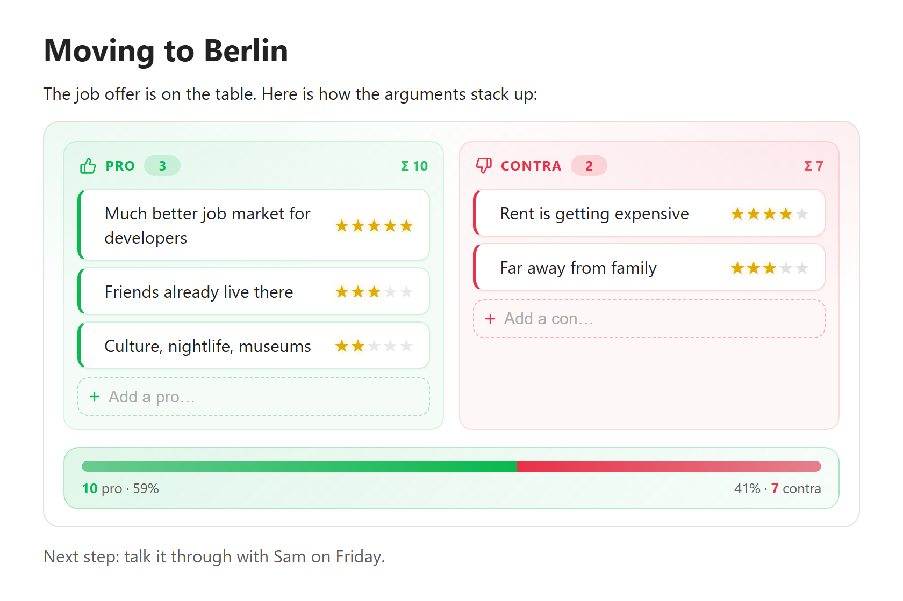
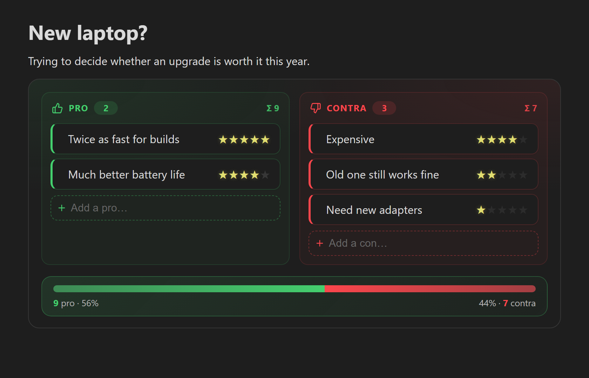
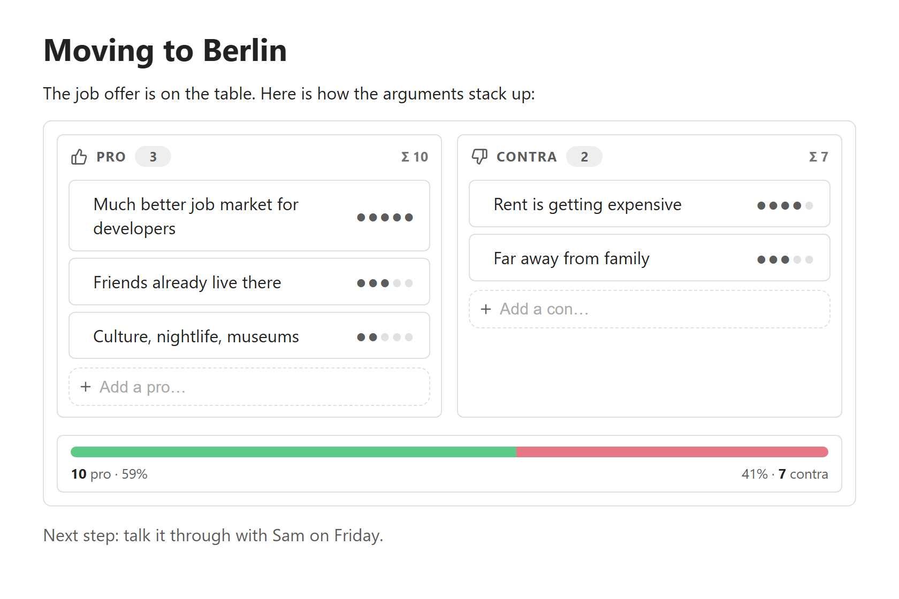
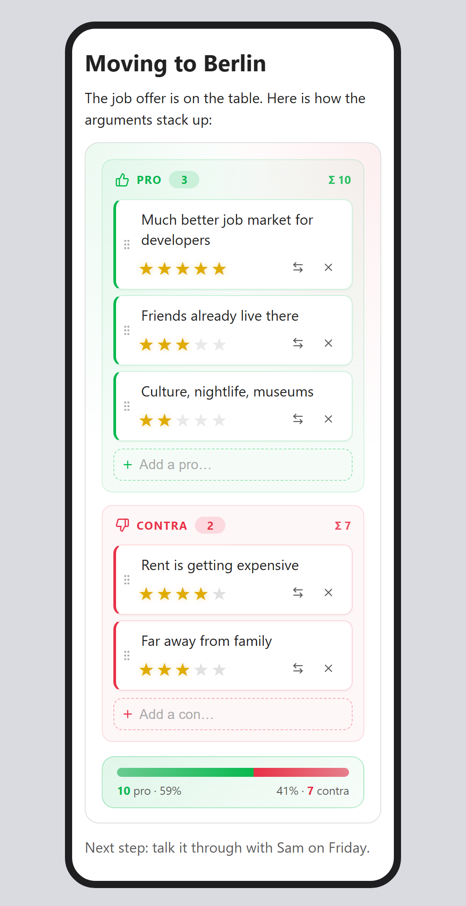

# Pro/Con Decisions

Weigh the pros and cons of a decision right inside your notes. You write a plain Markdown table of arguments with weights. Obsidian shows it as editable cards and a bar that shows which side wins.



## Features

- **Plain Markdown underneath.** Your data is an ordinary Markdown table inside a code block. It stays readable in any editor, even without the plugin.
- **Edit in the rendered view.** Add, rename, re-weight, move and delete arguments without touching the table syntax. This works in Live Preview and in Reading view.
- **Weights as symbols.** Click (or tap) a star to set how much an argument counts. You can choose stars, hearts, dots, diamonds, flames or bolts.
- **Result bar.** A green/red bar shows how the total weight splits between pro and contra.
- **Two designs.** *Colored*, with color and subtle animations, or *Plain*, which is quiet, low-color and has no animation.
- **Works on phones and tablets.** Touch-sized controls, and a layout that stacks on narrow screens.

## Screenshots

<table>
  <tr>
    <td width="50%"></td>
    <td width="50%"></td>
  </tr>
  <tr>
    <td align="center"><em>Colored design, dark theme</em></td>
    <td align="center"><em>Plain design, dots as weight symbol</em></td>
  </tr>
</table>

<p align="center">
  <br>
  <em>On a phone: columns stack and the controls are always visible</em>
</p>

## Usage

Run **Insert pro/con decision** from the command palette, or type a `procon` code block yourself:

````markdown
```procon
| Side | Argument                  | Weight |
| ---- | ------------------------- | ------ |
| pro  | Much better job market    | 5      |
| pro  | Friends already live there | 3     |
| con  | Rent is getting expensive | 4      |
| con  | Far away from family      | 3      |
```
````

You can put a decision anywhere in a note, between normal text, and have as many as you like.

### Syntax

| Column | What goes in it |
| ------ | --------------- |
| **Side** | `pro`, `+`, `yes`, `for` for arguments in favour. `con`, `contra`, `-`, `no`, `against` for arguments against. Case doesn't matter. |
| **Argument** | Any text. Write a literal pipe as `\|`. |
| **Weight** | A number (`1`–`10`), or a run of symbols such as `★★★` or `🔥🔥`. Empty means 1. |

- The header row and separator row are optional. Rows with an unknown side are ignored.
- An optional first line such as `# My question` is kept in the file but not displayed.

### Editing in the rendered view

| Action | How |
| ------ | --- |
| Add an argument | Type into **Add a pro…** / **Add a con…** and press Enter. The field stays focused, so you can keep typing. End the text with `!4` to set the weight at the same time. |
| Change the text | Click the text, edit it, then press Enter (or tap **Done**). Esc cancels. Clearing the text removes the argument. |
| Change the weight | Click a symbol. With the keyboard, focus the weight and use the arrow keys or 1–9. |
| Move to the other side | Use the ⇄ button. |
| Reorder or move | Drag the ⋮⋮ grip, with a mouse or a finger. |
| Delete | Use the × button. |

On desktop the buttons appear when you hover over a card. On touch devices they're always visible.

Every edit rewrites the table inside your note, so the Markdown always matches what you see. Undo (Ctrl/Cmd+Z in the editor) works as usual.

## Settings

| Setting | Options |
| ------- | ------- |
| **Design** | *Colored* (default) or *Plain*. |
| **Weight symbol** | Stars, hearts, dots, diamonds, flames or bolts. |
| **Maximum weight** | 3–10 symbols per argument (default 5). Higher weights in the file are capped to this value. |

## Installation

### From Obsidian (recommended)

Once the plugin is listed in the community plugin directory:

1. Open **Settings → Community plugins**. If needed, click **Turn on community plugins**.
2. Click **Browse** and search for **Pro/Con Decisions**.
3. Click **Install**, then **Enable**.

### Manual installation by downloading

Use this before the plugin is listed, or to install a specific version.

1. Open the [latest release](../../releases/latest) of this repository.
2. Under **Assets**, download these three files:
   - `main.js`
   - `manifest.json`
   - `styles.css`
3. In your vault, open the hidden folder `.obsidian/plugins/`. Create a folder named **`procon-decisions`** inside it. The folder name must match the plugin id.
   - **Windows:** in File Explorer, turn on *View → Show → Hidden items*.
   - **macOS:** in Finder, press <kbd>Cmd</kbd>+<kbd>Shift</kbd>+<kbd>.</kbd> to show hidden files.
4. Put the three files into that folder:
   ```
   <your vault>/.obsidian/plugins/procon-decisions/
   ├── main.js
   ├── manifest.json
   └── styles.css
   ```
5. In Obsidian, open **Settings → Community plugins**. Click the reload icon next to *Installed plugins*, then enable **Pro/Con Decisions**.

**Updating a manual install:** download the three files from the newer release, replace the old ones, then turn the plugin off and on again (or restart Obsidian).

**Phones and tablets:** Obsidian mobile can't easily reach the hidden `.obsidian` folder. The simplest way is to install on desktop and let your sync carry the plugin over. With Obsidian Sync, turn on *Installed community plugins* and *Active community plugin list* under **Settings → Sync**. iCloud, Syncthing and similar tools sync the folder automatically. Then enable the plugin on the phone.

## Compatibility

- Obsidian 1.4.0 or newer.
- Desktop (Windows, macOS, Linux) and mobile (iOS, Android).

## Privacy

This plugin makes no network requests and collects no data. It only reads and writes the `procon` code blocks in the notes you edit.

## Development

```bash
npm ci            # install dependencies
npm run dev       # rebuild main.js on every change
npm run build     # type-check and create a production build
npm run lint      # Obsidian's official review rules (eslint-plugin-obsidianmd)
npm test          # unit tests for the parser/serializer (Node ≥ 22.18)
npm run screenshots  # regenerate the README images in docs/ (needs Chrome or Edge)
```

To try changes, link or copy the project folder into `<vault>/.obsidian/plugins/procon-decisions/`. Reload the plugin after each build.

### Releasing

1. Run `npm version patch` (or `minor` / `major`). This updates `package.json`, `manifest.json` and `versions.json`, and creates a git tag.
2. Run `git push --follow-tags`.
3. The *Release* GitHub Action builds the plugin and creates a **draft** release with the three files. Review the draft on GitHub and publish it.

Tags have no `v` prefix: `1.0.1`, not `v1.0.1`.

## License

[MIT](LICENSE)
